[Read in English / Auf Englisch lesen](README.md)
***

# Sichere 3-Tier-Webanwendung auf Azure mit Qualys VMDR
### Architektur- und Sicherheitskonzept für Cloud-Umgebungen

    
    
    
    
    

---

### **1. Projektübersicht**

Dieses Projekt dokumentiert Aufbau, Absicherung und Überwachung einer 3-Tier-Webanwendung in Microsoft Azure. Es zeigt praxisorientierte Kompetenzen in Cloud-Architektur, Netzwerksicherheit und Schwachstellenmanagement.

Diese Dokumentation skizziert sowohl die **aktuelle Proof-of-Concept (PoC) Implementierung** als auch die **Zielarchitektur für Hochverfügbarkeit (HA)**. Dies zeigt eine klare Roadmap von einem funktionalen Prototyp zu einer unternehmenskritischen Lösung.

> Dieses Projekt demonstriert praxisnahe Kompetenzen in den Bereichen Backend-Architektur, Cloud Security und Schwachstellenmanagement in Azure-Umgebungen.

---

### **2. Architektur-Blaupausen**

#### **2.1 Aktuelle Implementierung (Proof-of-Concept)**

Dies ist die Architektur, die gebaut und validiert wurde. Der Fokus liegt auf funktionaler Korrektheit und fundamentalen Sicherheitsprinzipien wie der Netzwerksegmentierung.

```mermaid
graph TD
    subgraph "Azure VNet: vnet-main-project (10.0.0.0/16)"
        subgraph "snet-web (10.0.1.0/24)"
            VM1[<font size=5>🖥️</font><br><b>Web-Tier</b><br>vm-web-01<br>Public IP: 20.123.45.67]
        end

        subgraph "snet-app (10.0.2.0/24)"
            VM2[<font size=5>⚙️</font><br><b>App-Tier</b><br>vm-app-01]
        end

        subgraph "snet-db (10.0.3.0/24)"
            VM3[<font size=5>🗄️</font><br><b>Daten-Tier</b><br>vm-db-01<br>PostgreSQL]
        end
        VM1 -- "Port 5000" --> VM2
        VM2 -- "Port 5432" --> VM3
    end
```

#### **2.2 Zielarchitektur (Hochverfügbarkeit & Skalierbarkeit)**

Diese Blaupause repräsentiert die nächste Evolutionsstufe des Projekts, entworfen für Produktionsumgebungen. Sie führt Redundanz über mehrere Verfügbarkeitszonen (Availability Zones) und gemanagte Dienste ein, um einzelne Ausfallpunkte (Single Points of Failure) zu minimieren.

```mermaid
graph TD
    subgraph "Internet"
        User[<font size=5>💻</font><br>Benutzer]
    end

    subgraph "Azure VNet: vnet-main-project (10.0.0.0/16)"
        LB_Public[<font size=5>🌐</font><br><b>Öffentlicher Load Balancer</b>]
        
        subgraph "Web-Tier (snet-web)"
            direction LR
            VM1_AZ1[<font size=5>🖥️</font><br>vm-web-az1]
            VM1_AZ2[<font size=5>🖥️</font><br>vm-web-az2]
        end

        LB_Internal[<font size=5>🚦</font><br><b>Interner Load Balancer</b>]

        subgraph "App-Tier (snet-app)"
            direction LR
            VM2_AZ1[<font size=5>⚙️</font><br>vm-app-az1]
            VM2_AZ2[<font size=5>⚙️</font><br>vm-app-az2]
        end

        subgraph "Daten-Tier (snet-db)"
            DB_Managed[<font size=5>🗄️</font><br><b>Azure Database for PostgreSQL</b><br>mit Read Replica in AZ2]
        end

        User -- "HTTPS" --> LB_Public
        LB_Public -- "HTTP" --> VM1_AZ1 & VM1_AZ2
        VM1_AZ1 & VM1_AZ2 -- "API" --> LB_Internal
        LB_Internal -- "API" --> VM2_AZ1 & VM2_AZ2
        VM2_AZ1 & VM2_AZ2 -- "SQL" --> DB_Managed
    end
```

*Diese Zielarchitektur ist der nächste Meilenstein auf der Projekt-Roadmap und beinhaltet Azure Load Balancer, Virtual Machine Scale Sets und gemanagte Datenbankdienste für maximale Ausfallsicherheit.*

---

### **3. Technische Kernkompetenzen & Entscheidungen**

| Bereich | Implementierung & Begründung |
| :--- | :--- |
| **Cloud-Infrastruktur** | **Azure IaaS (VMs):** Bewusste Entscheidung für maximale Kontrolle über OS und Netzwerk, um Sicherheitskonzepte fundamental zu demonstrieren. |
| **Netzwerk-Sicherheit** | **VNet-Segmentierung & NSGs:** Strikte Trennung der Tiers. Die Datenbank-VM hat keine öffentliche IP und ist nur aus dem App-Subnetz erreichbar, was die Angriffsfläche drastisch reduziert. |
| **Vulnerability Management**| **Qualys Cloud Agent:** Installation auf allen Knoten für kontinuierliche Sichtbarkeit. Dies ermöglicht proaktives Patchen und Härten des Systems basierend auf Echtzeit-Daten statt auf Annahmen. |
| **Zugriffssteuerung** | **SSH über Bastion Host:** Der Zugriff auf die internen App- und DB-Server erfolgt ausschließlich über die Web-VM (`vm-web-01`), die als gesicherter Sprungserver dient. |

---

### **4. Lessons Learned & Business Impact**

*   **Sichtbarkeit ist die Währung der Sicherheit:** Man kann nur schützen, was man sieht. Ohne die durch Qualys geschaffene Transparenz wären kritische Schwachstellen unentdeckt geblieben.
*   **Architektur schlägt nachträgliche Korrekturen:** Eine gut geplante, segmentierte Architektur ist die effektivste und kostengünstigste Sicherheitsmaßnahme. Sie verhindert die laterale Ausbreitung von Angriffen im Keim.
*   **Sicherheit ist ein Prozess, kein Produkt:** Der demonstrierte Zyklus aus **Identifizieren -> Beheben -> Validieren** ist das Fundament eines jeden robusten Security-Programms.

---

### **5. Zukünftige Roadmap & nächste Schritte**

Dieses Projekt ist eine solide Basis. Die nächsten logischen Evolutionsstufen sind:

-   [ ] **Infrastructure as Code (IaC):** Automatisierung des gesamten Setups mit **Terraform**, um die Umgebung versionierbar, reproduzierbar und skalierbar zu machen.
-   [ ] **DevSecOps - "Shift Left":** Integration von Sicherheits-Scans in eine **CI/CD-Pipeline** (z.B. mit GitHub Actions), um Schwachstellen bereits im Entwicklungszyklus zu finden.
-   [ ] **Advanced Threat Detection:** Zentralisierung von Logs in **Microsoft Sentinel (SIEM)** zur proaktiven Erkennung von Anomalien und Angriffsmustern.

---

### **Über den Autor**

**Alireza Barkesh**

Ein leidenschaftlicher und zielstrebiger Softwareentwickler mit einem starken Fokus auf Backend-Technologien und Cybersicherheit. Ich verfolge aktiv eine anspruchsvolle 3-Jahres-Lern-Roadmap, um tiefgreifende Expertise an der Schnittstelle von sicherer Softwareentwicklung und moderner Cloud-Infrastruktur aufzubauen.

[Mein LinkedIn Profil](https://www.linkedin.com/in/barkesh) | [Mein GitHub Profil](https://github.com/barkesh)
