[Read in German / Auf Deutsch lesen](README.de.md)
***

# Secure 3-Tier Web Application on Azure with Qualys VMDR
### Architecture and Security Concept for Cloud Environments

    
    
    
    
    

---

### **1. Project Overview**

This project documents the setup, security, and monitoring of a 3-tier web application in Microsoft Azure. It demonstrates practical skills in cloud architecture, network security, and vulnerability management.

This documentation outlines both the **current Proof-of-Concept (PoC) implementation** and the **target architecture for High Availability (HA)**, showcasing a clear roadmap from a functional prototype to an enterprise-grade solution.

> This project demonstrates hands-on skills in backend architecture, cloud security, and vulnerability management in Azure environments.

---

### **2. Architectural Blueprints**

#### **2.1 Current Implementation (Proof-of-Concept)**

This is the architecture that was built and validated. The focus is on functional correctness and fundamental security principles like network segmentation.

```mermaid
graph TD
    subgraph "Azure VNet: vnet-main-project (10.0.0.0/16)"
        subgraph "snet-web (10.0.1.0/24)"
            VM1[<font size=5>🖥️</font><br><b>Web Tier</b><br>vm-web-01<br>Public IP: 20.123.45.67]
        end

        subgraph "snet-app (10.0.2.0/24)"
            VM2[<font size=5>⚙️</font><br><b>App Tier</b><br>vm-app-01]
        end

        subgraph "snet-db (10.0.3.0/24)"
            VM3[<font size=5>🗄️</font><br><b>Data Tier</b><br>vm-db-01<br>PostgreSQL]
        end
        VM1 -- "Port 5000" --> VM2
        VM2 -- "Port 5432" --> VM3
    end
```

#### **2.2 Target Architecture (High Availability & Scalability)**

This blueprint represents the project's next evolution, designed for production environments. It introduces redundancy across multiple Availability Zones (AZs) and managed services to minimize single points of failure.

```mermaid
graph TD
    subgraph "Internet"
        User[<font size=5>💻</font><br>User]
    end

    subgraph "Azure VNet: vnet-main-project (10.0.0.0/16)"
        LB_Public[<font size=5>🌐</font><br><b>Public Load Balancer</b>]
        
        subgraph "Web Tier (snet-web)"
            direction LR
            VM1_AZ1[<font size=5>🖥️</font><br>vm-web-az1]
            VM1_AZ2[<font size=5>🖥️</font><br>vm-web-az2]
        end

        LB_Internal[<font size=5>🚦</font><br><b>Internal Load Balancer</b>]

        subgraph "App Tier (snet-app)"
            direction LR
            VM2_AZ1[<font size=5>⚙️</font><br>vm-app-az1]
            VM2_AZ2[<font size=5>⚙️</font><br>vm-app-az2]
        end

        subgraph "Data Tier (snet-db)"
            DB_Managed[<font size=5>🗄️</font><br><b>Azure Database for PostgreSQL</b><br>with Read Replica in AZ2]
        end

        User -- "HTTPS" --> LB_Public
        LB_Public -- "HTTP" --> VM1_AZ1 & VM1_AZ2
        VM1_AZ1 & VM1_AZ2 -- "API" --> LB_Internal
        LB_Internal -- "API" --> VM2_AZ1 & VM2_AZ2
        VM2_AZ1 & VM2_AZ2 -- "SQL" --> DB_Managed
    end
```

*This target architecture is the next milestone on the project roadmap, incorporating Azure Load Balancers, Virtual Machine Scale Sets, and managed database services for maximum resilience.*

---

### **3. Core Technical Competencies & Decisions**

| Domain | Implementation & Rationale |
| :--- | :--- |
| **Cloud Infrastructure** | **Azure IaaS (VMs):** A deliberate choice for maximum control over the OS and network layers, essential for demonstrating fundamental security concepts. |
| **Network Security** | **VNet Segmentation & NSGs:** Strict tier isolation. The database VM has no public IP and is only accessible from the app subnet, drastically reducing the attack surface. |
| **Vulnerability Management**| **Qualys Cloud Agent:** Deployed on all nodes for continuous visibility, enabling proactive patching and system hardening based on real-time data, not assumptions. |
| **Access Control** | **SSH via Bastion Host:** Access to internal app and DB servers is restricted through the web VM (`vm-web-01`), which functions as a hardened jump server. |

---

### **4. Lessons Learned & Business Impact**

*   **Visibility is the currency of security:** You can only protect what you can see. Without the transparency from Qualys, critical vulnerabilities would remain hidden.
*   **Architecture trumps after-the-fact fixes:** A well-planned, segmented architecture is the most effective and cost-efficient security measure, preventing lateral movement by design.
*   **Security is a process, not a product:** The demonstrated cycle of **Identify -> Remediate -> Validate** is the foundation of any robust security program.

---

### **5. Future Roadmap & Next Steps**

This project is a solid foundation. The next logical evolutions are:

-   [ ] **Infrastructure as Code (IaC):** Automate the entire setup using **Terraform** to make the environment versionable, reproducible, and scalable.
-   [ ] **DevSecOps - "Shift Left":** Integrate security scans directly into a **CI/CD pipeline** (e.g., with GitHub Actions) to find vulnerabilities early in the development cycle.
-   [ ] **Advanced Threat Detection:** Centralize logs into **Microsoft Sentinel (SIEM)** for proactive detection of anomalies and attack patterns.

---

### **About the Author**

**Alireza Barkesh**

A passionate and driven software developer with a strong focus on backend technologies and cybersecurity.

[My LinkedIn Profile](https://www.linkedin.com/in/barkesh) | [My GitHub Profile](https://github.com/barkesh)
